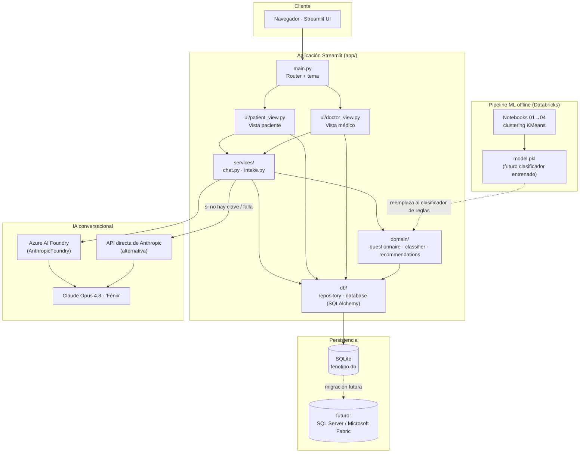
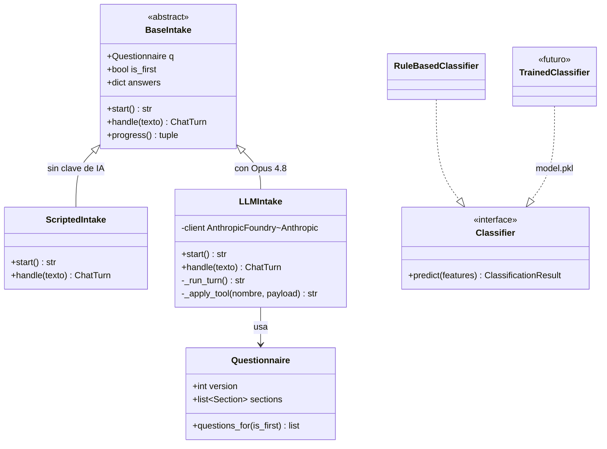
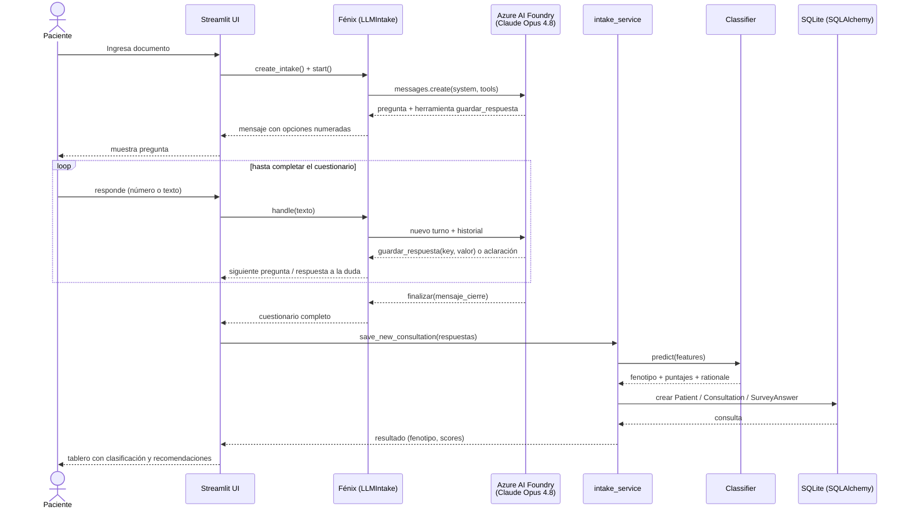
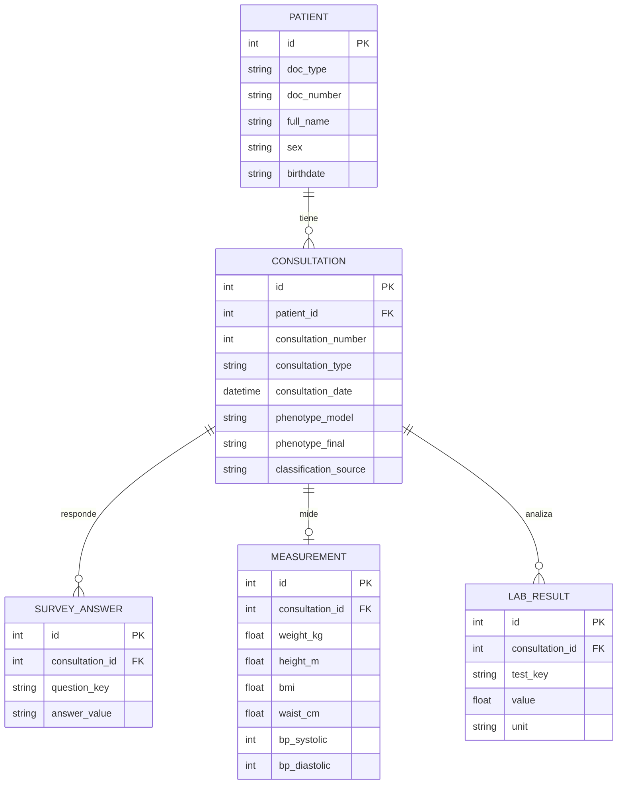

# Fenotipo Médico · Segmentación Inteligente de Pacientes (Comfama)

Prototipo del programa de **Medicina Funcional de Comfama** que segmenta
pacientes por fenotipo clínico (**Obesidad · Dislipidemia · Glicemia ·
Digestivo · Bajo riesgo**) integrando hábitos de vida y datos clínicos.

> ⚠️ Prototipo con fines de demostración. Las recomendaciones no reemplazan la
> valoración médica. El manejo de datos clínicos está sujeto a la autorización
> del paciente y al marco de habeas data y políticas internas de Comfama.

## Características

- **Vista del paciente**: ingreso por documento, cuestionario **conversacional**
  (chat con Opus 4.8, con flujo guiado de respaldo), tablero con gráficas,
  clasificación y recomendaciones. Regla de **cita de seguimiento cada 30 días**.
- **Vista del médico**: búsqueda de pacientes, ingreso de datos básicos
  (peso, estatura, **IMC autocalculado**, perímetro abdominal, presión arterial),
  laboratorios (colesterol total, etc.), y **reclasificación por criterio médico**.
- **Historial de consultas** numeradas (#1, #2, #3…) por paciente.

## Arquitectura

```
app/
  main.py            Entrada Streamlit (navegación)
  config.py          Rutas, paleta de marca, reglas
  db/                SQLAlchemy: modelos, sesión, repositorio
  domain/            Cuestionario, clasificador (reglas → swappable a IA), recomendaciones
  services/          chat.py (Opus 4.8 + respaldo), intake.py (clasificar + persistir)
  ui/                branding, charts, patient_view, doctor_view
  assets/            logo.svg, styles.css
data/
  questionnaire.yaml Fuente de verdad de las preguntas
  fenotipo.db        SQLite (se crea solo; ignorado por git)
databricks/          Notebooks de clustering (pipeline ML offline, ver su propio README)
scripts/seed_demo.py Pacientes de demostración
```

### Diagrama de arquitectura

Capas de la aplicación y sistemas externos con los que se integra:



### Diagrama de componentes

El cuestionario de ingreso usa un patrón *strategy* intercambiable (`BaseIntake`),
igual que la clasificación (`Classifier`) — así el prototipo basado en reglas y
el futuro modelo entrenado conviven detrás de la misma interfaz:



### Diagrama de flujo (cuestionario conversacional → clasificación)



### Base de datos (recomendación para el prototipo)
**SQLite + SQLAlchemy ORM**. Esquema normalizado y listo para migrar a
SQL Server / Microsoft Fabric:
`patients` 1—N `consultations` 1—N `survey_answers` (llave-valor / EAV),
`consultations` 1—1 `measurements`, 1—N `lab_results`.
El modelo EAV permite evolucionar el cuestionario sin cambiar el esquema.



### Modelo de clasificación
Hoy: clasificador **basado en reglas** transparente (`app/domain/classifier.py`),
detrás de la interfaz `Classifier`. El futuro modelo entrenado con los datos
históricos (pipeline de clustering en `databricks/`, ver su propio README) se
conecta guardándolo en `data/model.pkl`, sin tocar la UI ni la base de datos.

### Asistente conversacional ("Fénix")
El cuestionario de ingreso lo conduce **Fénix**, con dos implementaciones
intercambiables detrás de la misma interfaz `BaseIntake`:

- **`LLMIntake`** — usa Claude Opus 4.8 (vía Azure AI Foundry o la API directa
  de Anthropic, según `.env`). Presenta las opciones numeradas, valida el
  formato de cada respuesta y solo resuelve dudas sobre la pregunta pendiente.
- **`ScriptedIntake`** — flujo guiado determinista de respaldo (sin IA), para
  que el prototipo funcione aunque no haya credenciales configuradas.

## Puesta en marcha

```bash
# 1. (opcional) entorno virtual
py -m venv .venv && .venv\Scripts\activate

# 2. dependencias
py -m pip install -r requirements.txt

# 3. claves/credenciales (opcional; sin ellas se usan los flujos de respaldo)
copy .env.example .env
# - ANTHROPIC_API_KEY (+ ANTHROPIC_FOUNDRY_RESOURCE si usas Azure AI Foundry): chat con IA
# - FABRIC_SQL_USER: consulta de exámenes médicos en Microsoft Fabric desde la consola médica

# 4. datos de demostración (opcional)
py scripts/seed_demo.py

# 5. ejecutar
streamlit run app/main.py
```

Abrir http://localhost:8501

- **Pacientes demo**: `CC 1001` (Digestivo), `CC 1002` (Glicemia).
- **PIN consola médica**: `comfama`.
- **Exámenes médicos (Fabric)**: en la consola médica, tras buscar un paciente,
  el botón "🔬 Consultar exámenes en sistema central (Fabric)" trae el
  resultado más reciente de cada laboratorio desde
  `LH_FabricData.Hackaton2026.ResultadosAyudasDiagnosticas` y prellena los
  campos de laboratorio (revisar y guardar sigue siendo manual). Requiere
  `FABRIC_SQL_USER` en `.env`; la primera consulta pide login interactivo de
  Azure AD (la cuenta del workspace tiene MFA, por eso no usa contraseña).
